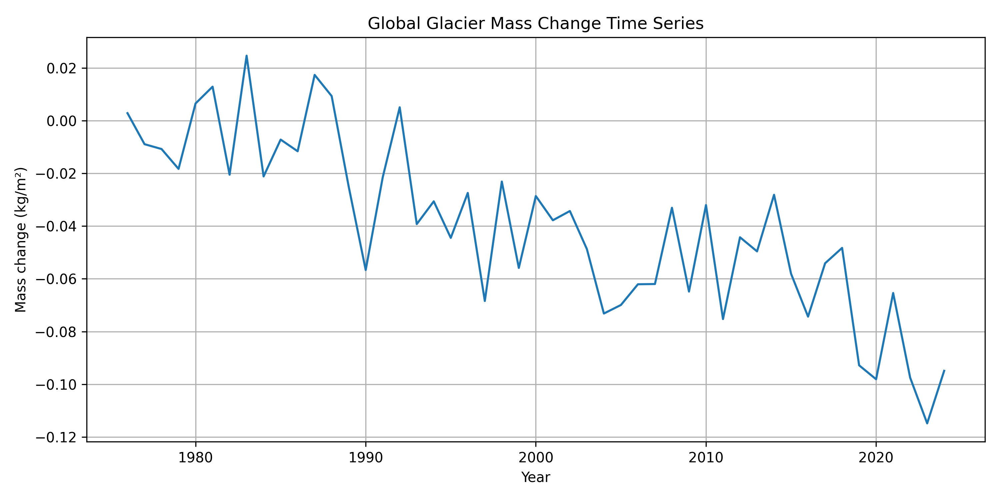

  
[](https://github.com/czarmanu/glacial_mass_balance_ts_interview/blob/main/LICENSE)  
[](https://doi.org/10.5904/wgms-amce-2025-02b)

# Annual mass-change estimates (world’s glaciers, time series)

This Python project automates the download, extraction, analysis, and visualization of the WGMS gridded glacier mass change (global, annual) dataset.



---

## File structure

A single NetCDF4 file provides glacier mass change and area on a 0.5° latitude-longitude grid for hydrological years 1976–2024:

```
global-gridded-annual-glacier-mass-change.nc4
```

---

## Dimensions and data variables

- **Dimensions**:
  - `time`: Hydrological year (e.g., 1976-01-01)
  - `lat`: Latitude (WGS 84 – EPSG:4326)
  - `lon`: Longitude (WGS 84 – EPSG:4326)

- **Data variables**:
  - `glacier_mass_change_gt`: Glacier mass change in Gt  
  - `glacier_mass_change_mwe`: Glacier mass change in m w.e.  
  - `glacier_area_km2`: Glacier area in km²  
  - `uncertainty_gt`: Glacier mass change uncertainty in Gt  
  - `uncertainty_mwe`: Glacier mass change uncertainty in m w.e.

---

## Usage

### Run the full analysis:

```bash
python3 src/main.py
```

### Optional CLI flags:

```bash
python3 src/main.py --plot-only         # Only generate plot
python3 src/main.py --summary-only      # Only compute summary table
python3 src/main.py --force-download    # Force re-download and re-unzip
```

---

## Features

- Downloads the official ZIP file from [wgms.ch](https://wgms.ch/mass_change_estimates/)
- Unzips and extracts the `.nc4` NetCDF file
- Computes global average glacier mass change over time
- Generates:
  - `results/summary_statistics.csv`
  - `results/mass_change_timeseries.png`

---

## Requirements

- Python 3.10+

Install dependencies:

```bash
pip3 install -r requirements.txt
```

---

## Code structure

| File                              | Purpose                                                                |
|-----------------------------------|------------------------------------------------------------------------|
| `src/main.py`                     | Orchestrates download, extraction, analysis, plotting                  |
| `src/config.py`                   | Stores constants such as file paths and URLs                           |
| `src/utils_netcdf.py`             | Helper functions for NetCDF handling and analysis                      |
| `src/test_file_exists.py`         | Unit test to verify the presence and structure of the NetCDF file.     |
| `src/test_netcdf_structure.py`    | Unit test to verify the structure and content of the NetCDF file.      |

---

## Development

Run tests:

```bash
pytest
```

Check code style:

```bash
flake8 .
```

---

## Contributing

Pull requests and issues are welcome.  
Please lint your code with `flake8` and include tests where relevant.

---

## Citation

Dussaillant, I., Hugonnet, R., Huss, M., Berthier, E., Bannwart, J., Paul, F., and Zemp, M. (2025):  
*Annual mass-change estimates for the world's glaciers. Individual glacier time series and gridded data products.*  
https://doi.org/10.5904/wgms-amce-2025-02b

---

## Related Publication

Dussaillant, I., Hugonnet, R., Huss, M., Berthier, E., Bannwart, J., Paul, F., and Zemp, M. (2025):  
*Annual mass change of the world's glaciers from 1976 to 2024 by temporal downscaling of satellite data with in-situ observations.*  
Earth System Science Data. https://doi.org/10.5194/essd-17-1977-2025
